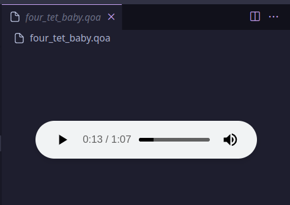

# QOA Preview for VS Code
This is an extension that allows playing of [Quite OK Audio (QOA)](https://qoaformat.org/) audio files.

This is designed to be similar to the built-in audio player VS Code uses for WAV, MP3, etc.

## Installation
Download the latest VSIX from the Releases page and install it to VS Code:

    wget https://github.com/braheezy/vscode-qoa-preview/releases/download/v0.1.0/qoa-preview-0.1.0.vsix
    code --install-extension qoa-preview-0.1.0.vsix

## Usage
Click on a QOA file, and play it! There is support for:

- Play/pause
- Mute
- Seek

To convert audio files to and from the QOA format, or for a more featured player, check out [`goqoa`](https://github.com/braheezy/goqoa)!

## Extension Settings
There are no settings.

## Contributing

1. Fork the repository.
1. Create your feature.
1. Commit your changes.
1. Push to the branch.
1. Open a pull request.

## Development
This project uses [Bun](https://bun.sh/) as it's JavaScript runtime, so ensure that's installed.

I found it quicker to iterate on the HTML/JS/CSS outside of VS Code, so that's what in `test/` and it can be hosted with `bun run local`. Those files are not 100% copy-paste-able to the extension code, so watch out.

Once you're ready to test in VS Code, you should be able to press F5 in this project to auto-launch the debug config. You'll want to open the Web Developer Tools using the Command Palette for classic web dev debugging tools.

`src/` contains:
- `extension.ts`: The main entry point for the extension. Boilerplate.
- `qoaDecoder.js`: Vendored QOA decoder
- `qoaPreview.ts`: The main logic for the extension, and notably, where the HTML template is.
- `media/`: JS/CSS/SVG assets for rendering.

To package the extension into a VSIX file:

    bun run package

## Credits
- [pfusik's QOA Decoder JS transpile](https://github.com/pfusik/qoa-fu/blob/c8e18a7d269f97c12e9be63b1ae30ebb47cb3366/transpiled/QOA.js) to decode QOA files. I've vendored the MIT licensed file into this project.
- [lalunamel's bun-vscode-extension](https://github.com/lalunamel/bun-vscode-extension) to scaffold the project.
- [VS Code's built-in media-preview extension](https://github.com/microsoft/vscode/tree/main/extensions/media-preview) for how they load and play audio files.
